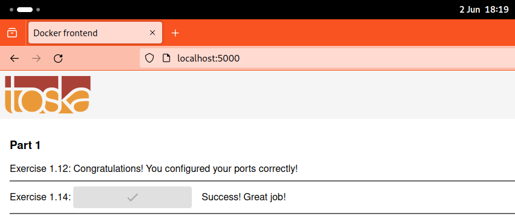

# 3.7

The images were switched to Alpine-based images already in the optimization task in 3.6. See further details in that folder.

The final image sizes:

```text
➜  3.7 git:(main) ✗ docker image ls | grep end
example-frontend          latest    c0a69f0548d3   16 minutes ago   474MB
example-backend           latest    03d7f3325ccd   37 minutes ago   248MB
```

Screenshot to show that the images still work:


